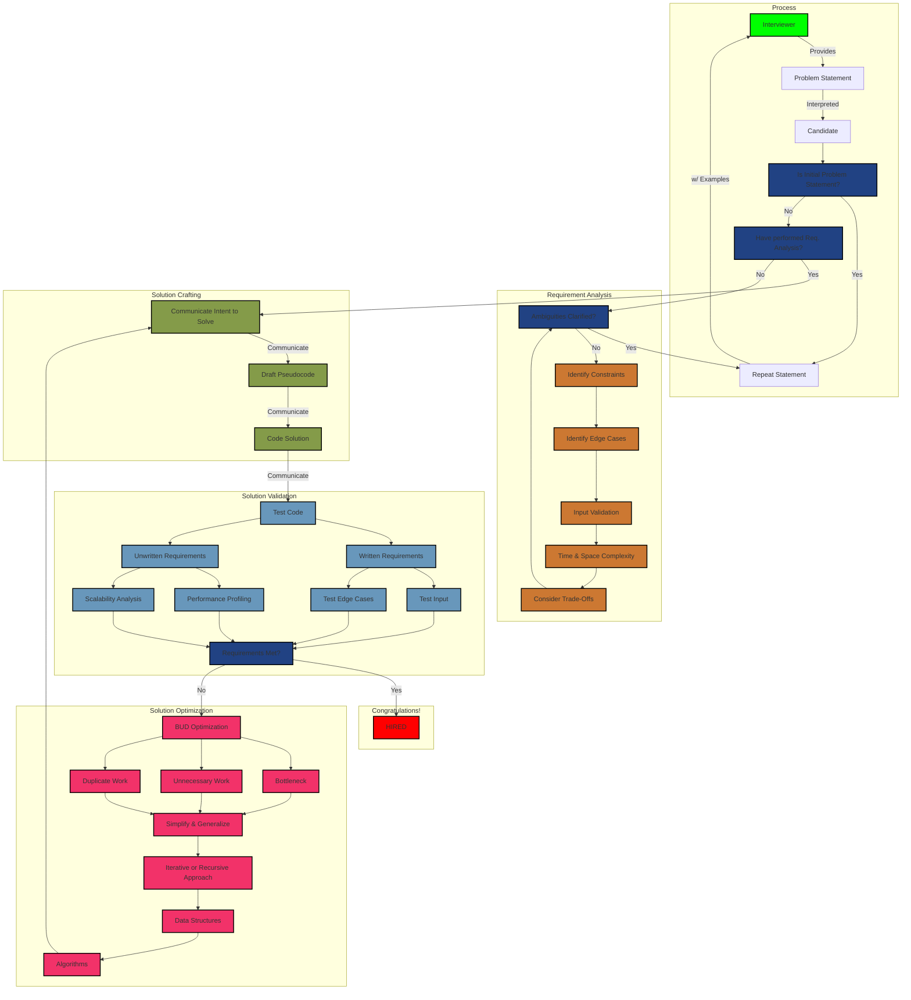

```mermaid
graph TD

subgraph Process
    I[Interviewer]
    C[Candidate]
    PS[Problem Statement]
    R[Repeat Statement]
    IP[Is Initial Problem Statement?]
    UP[Have performed Req. Analysis?]
end

subgraph Requirement Analysis
    AC[Ambiguities Clarified?]
    IC[Identify Constraints]
    IEC[Identify Edge Cases]
    IV[Input Validation]
    CTO[Consider Trade-Offs]
    TSC[Time & Space Complexity]
end

subgraph Solution Crafting
   CI[Communicate Intent to Solve]
   DS[Draft Pseudocode]
   CS[Code Solution]
end

subgraph Solution Validation
   WR[Written Requirements]
   UR[Unwritten Requirements]
   TC[Test Code]
   TI[Test Input]
   TEC[Test Edge Cases]
   PP[Performance Profiling]
   SA[Scalability Analysis]
   RM[Requirements Met?]
end

subgraph Solution Optimization
   BUD[BUD Optimization]
   BUDB[Bottleneck]
   BUDU[Unnecessary Work]
   BUDD[Duplicate Work]
   SG[Simplify & Generalize]
   DaSt[Data Structures]
   Al[Algorithms]
   IR[Iterative or Recursive Approach]
end

subgraph Congratulations!
   HIRED[HIRED]
end

I -->|Provides| PS
PS -->|Interpreted| C
C --> IP 
IP --> |Yes| R
R --> |w/ Examples| I
IP --> |No| UP
UP -->|Yes| CI
UP --> |No| AC

AC -->|Yes| R
AC -->|No| IC
IC --> IEC
IEC --> IV
IV --> TSC
TSC --> CTO
CTO --> AC

CI --> |Communicate|DS 
DS --> |Communicate|CS
CS --> |Communicate|TC

TC --> WR
WR --> TI
WR --> TEC
TC --> UR
UR --> PP
UR --> SA

TI --> RM
TEC --> RM
PP --> RM
SA --> RM
RM --> |Yes| HIRED
RM --> |No| BUD

BUD --> BUDB --> SG
BUD --> BUDU --> SG
BUD --> BUDD --> SG
SG --> IR
IR -->DaSt
DaSt --> Al
Al --> CI

classDef startColor fill:#00ff00,stroke:#000,stroke-width:2px;
classDef endColor fill:#ff0000,stroke:#000,stroke-width:2px;

class I, startColor
class HIRED, endColor

classDef requirementAnalysis fill:#cc7832,stroke:#000,stroke-width:2px;
classDef solutionCrafting fill:#849b49,stroke:#000,stroke-width:2px;
classDef solutionValidation fill:#6897BB,stroke:#000,stroke-width:2px;
classDef solutionOptimization fill:#f23269,stroke:#000,stroke-width:2px;
classDef question fill:#214283,stroke:#000,stroke-width:2px;

class IC,IEC,IV,TSC,CTO requirementAnalysis
class CI,DS,CS solutionCrafting
class TC,WR,UR,TI,TEC,PP,SA solutionValidation
class BUD,BUDB,BUDU,BUDD,IR,DaSt,Al,SG, solutionOptimization
class IP,UP,AC,RM question
```
